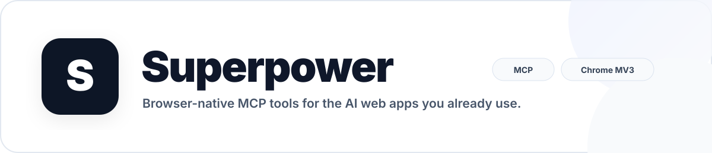

<div align="center">
  

  <h1>Superpower</h1>

  <p><strong>Bring MCP tools directly into the AI web apps you already use.</strong></p>
  <p>ChatGPT · Gemini · Perplexity · Grok · GitHub Copilot · Qwen · DeepSeek · Kimi · Mistral · more</p>

  <p>
    <a href="https://github.com/stloendays/Superpower-V1/stargazers"></a>
    
    
    
    <a href="LICENSE"></a>
  </p>

  <p>
    <a href="#why-superpower">Why Superpower</a> ·
    <a href="#features">Features</a> ·
    <a href="#supported-platforms">Platforms</a> ·
    <a href="#how-it-works">Architecture</a> ·
    <a href="#quick-start">Quick start</a>
  </p>
</div>

<p align="center">
  
</p>

<p align="center">
  
</p>

<div align="center">
  <strong>Oxford × NUS collaboration · led by Tony</strong><br/>
  <sub>Practical browser-native MCP workflows for modern AI assistants.</sub>
</div>

<br/>

## Why Superpower?

Superpower keeps you inside the AI interface you already use while adding a controlled MCP execution layer behind it. Models can discover tools, call them, and receive structured results without moving to a separate agent console.

<table>
<tr>
<td width="33%" valign="top">

### Stay in the chat
Use MCP capabilities without leaving supported AI websites.

</td>
<td width="33%" valign="top">

### Connect real tools
Use local or remote MCP servers over SSE, Streamable HTTP, or WebSocket.

</td>
<td width="33%" valign="top">

### Keep control
Choose exposed tools and review guarded actions before execution.

</td>
</tr>
</table>

<p align="center">
  
</p>

## Features

- MCP tool discovery and visibility controls inside supported AI pages
- Structured tool-call detection, execution, and result injection
- Manual and automated execution flows
- Local and remote MCP endpoints
- Multi-tool and dependency-aware workflows
- Persistent sidebar preferences and generated MCP instructions

<table>
<tr>
<td width="50%" align="center" valign="top">
  
  <br /><sub>Connection, tools and automation controls.</sub>
</td>
<td width="50%" align="center" valign="top">
  
  <br /><sub>Tool calls routed through MCP and returned to the chat.</sub>
</td>
</tr>
</table>

### Natural-language Action Router

Superpower V1.5 adds a review-first Action Router that maps natural-language intent to MCP capabilities, drafts schema-backed parameters, surfaces risk, and sends the action through an explicit review step before execution.

<p align="center">
  
</p>

## Supported platforms

ChatGPT, Google Gemini, Perplexity, Google AI Studio, Grok, OpenRouter, DeepSeek, T3 Chat, GitHub Copilot, Mistral, Kimi, Qwen Chat, and Z.ai.

<p align="center">
  
</p>

## How it works

<p align="center">
  
</p>

1. The AI interface produces a structured tool call.
2. Superpower detects it and forwards the request through the configured MCP connection.
3. The MCP server executes the tool.
4. The result is returned to the same conversation.

## Quick start

### Install a release

1. Download the [latest release](https://github.com/stloendays/Superpower-V1/releases/latest).
2. Extract it and run `Install-Superpower.cmd`.
3. Open `chrome://extensions/` and enable **Developer mode**.
4. Select **Load unpacked** and choose the generated `dist/` folder.

See [`RELEASE_INSTALL.md`](RELEASE_INSTALL.md) for the full installation guide.

### Build from source

Requirements: **Node.js 22.12+**, **pnpm 9.x**, and a Chromium-based browser.

```bash
git clone https://github.com/stloendays/Superpower-V1.git
cd Superpower-V1
pnpm install
pnpm base-build
```

Configure an MCP proxy, start it with your preferred transport, then load `dist/` as an unpacked extension.

Example SSE proxy:

```bash
npx -y @srbhptl39/mcp-superassistant-proxy@latest \
  --config ./config.json \
  --outputTransport sse
```

> The proxy package keeps the `mcp-superassistant-proxy` name for upstream compatibility.

## Development

```bash
pnpm dev          # Development build
pnpm base-build   # Production build
pnpm type-check   # Type checking
pnpm lint         # Lint
```

## Project

Superpower is an **Oxford × NUS collaborative project led by Tony**, focused on practical browser-native human–AI workflows and MCP-based tool use.

Superpower V1 is a modified derivative of **MCP SuperAssistant**. The original MIT license and upstream attribution are preserved in [`LICENSE`](LICENSE) and [`NOTICE.md`](NOTICE.md).

## Security

MCP servers may expose filesystem, database, developer-tool, or third-party API access. Only connect endpoints you trust and keep credentials outside the repository. See [`SECURITY.md`](SECURITY.md).

## Contributing

Issues and pull requests are welcome. For bug reports, include the affected platform, browser version, and reproduction steps.

## License

Released under the [MIT License](LICENSE), with upstream attribution described in [NOTICE.md](NOTICE.md).
