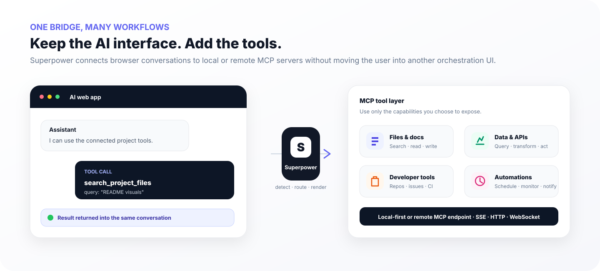

<div align="center">
  

  <h1>Superpower</h1>

  <p><strong>Bring MCP tools directly into the AI web apps you already use.</strong></p>
  <p>ChatGPT · Gemini · Perplexity · Grok · GitHub Copilot · Qwen · DeepSeek · Kimi · Mistral · more</p>

  <p>
    <a href="https://github.com/stloendays/Superpower-V1/stargazers"></a>
    
    
    
    <a href="LICENSE"></a>
  </p>

  <p>
    <a href="#why-superpower">Why Superpower</a> ·
    <a href="#features">Features</a> ·
    <a href="#supported-platforms">Platforms</a> ·
    <a href="#how-it-works">Architecture</a> ·
    <a href="#quick-start">Quick start</a> ·
    <a href="#contributing">Contributing</a>
  </p>
</div>

<p align="center">
  
</p>

<p align="center">
  
</p>

<div align="center">
  <strong>Oxford × NUS collaboration · led by Tony</strong><br/>
  <sub>Practical browser-native MCP workflows for modern AI assistants.</sub>
</div>

<br/>

## Why Superpower?

Most agent frameworks ask users to leave the interface where they are already working. Superpower takes the opposite approach: keep the browser conversation, add a controlled MCP execution layer behind it, and return structured tool results back into the same flow.

<p align="center">
  
</p>

<table>
<tr>
<td width="33%" valign="top">

### Stay in the conversation
Use supported AI websites without switching to a separate orchestration console.

</td>
<td width="33%" valign="top">

### Connect real tools
Expose local or remote MCP servers over SSE, Streamable HTTP, or WebSocket.

</td>
<td width="33%" valign="top">

### Keep control
Choose which tools are visible, review detected calls, and keep guarded actions behind explicit execution paths.

</td>
</tr>
</table>

## Features

<table>
<tr>
<td width="50%" valign="top">

### MCP control inside the page

- Connection status and transport selection
- Tool discovery and enable/disable controls
- MCP instruction generation and insertion
- Automation delay controls
- Persistent sidebar preferences
- Local and remote endpoint support

</td>
<td width="50%" valign="top">

### Tool execution workflow

- Detect structured function calls in supported assistants
- Render tool-call and tool-result blocks
- Manual or automated execution flows
- Inject returned results into the active conversation
- Handle ChatGPT MCP attachment refresh flows
- Support multi-tool and dependency-aware workflows

</td>
</tr>
</table>

<table>
<tr>
<td width="50%" align="center" valign="top">
  
  <br /><sub>Connection, tool visibility, instructions and automation controls.</sub>
</td>
<td width="50%" align="center" valign="top">
  
  <br /><sub>Structured tool calls routed through MCP and returned to the chat.</sub>
</td>
</tr>
</table>

### Natural-language Action Router

The current development line adds a review-first Action Router: natural-language intent is matched to an MCP capability, parameters are drafted against the tool schema, execution risk is surfaced, and the selected action is opened for explicit review before the existing guarded call path is used.

<p align="center">
  
</p>

## Supported platforms

The current adapter set includes ChatGPT, Google Gemini, Perplexity, Google AI Studio, Grok, OpenRouter, DeepSeek, T3 Chat, GitHub Copilot, Mistral, Kimi, Qwen Chat, and Z.ai.

<p align="center">
  
</p>

| Platform | Domain | Platform | Domain |
| --- | --- | --- | --- |
| ChatGPT | `chatgpt.com` | Google Gemini | `gemini.google.com` |
| Perplexity | `perplexity.ai` | Google AI Studio | `aistudio.google.com` |
| Grok | `grok.com` / `x.com` | OpenRouter | `openrouter.ai` |
| DeepSeek | `chat.deepseek.com` | T3 Chat | `t3.chat` |
| GitHub Copilot | `github.com/copilot` | Mistral | `chat.mistral.ai` |
| Kimi | `kimi.com` | Qwen Chat | `chat.qwen.ai` |
| Z.ai | `chat.z.ai` |  |  |

> Web UI changes can affect DOM-based adapters. If a platform changes its composer or response markup, please open an issue with the affected platform and browser version.

## How it works

<p align="center">
  
</p>

At a high level:

1. A supported AI website produces a structured tool call.
2. Superpower detects and parses the call in the browser.
3. The request is forwarded through the configured MCP connection.
4. The MCP server executes the tool and returns structured output.
5. Superpower renders or inserts that result into the same conversation so the model can continue.

This separates the **conversation surface**, **browser control layer**, and **MCP execution layer** while keeping the user experience continuous.

## Project & collaboration

Superpower is developed as a collaborative project between the **University of Oxford** and the **National University of Singapore (NUS)**. The project is **led by Tony**, who drives the project direction, architecture, integration strategy, and release coordination.

The collaboration focuses on practical human–AI workflows: reducing friction between conversational models and external tools, making MCP-based agent workflows easier to deploy, and improving how models discover, call, and chain capabilities inside familiar interfaces.

Superpower V1 is a modified derivative of **MCP SuperAssistant**. The original MIT license and upstream attribution are preserved in [`LICENSE`](LICENSE) and [`NOTICE.md`](NOTICE.md). Superpower extends that foundation with its own branding, workflow design, compatibility work, routing logic, release engineering, and product direction.

## Quick start

### Windows release installation

1. Open the [latest release](https://github.com/stloendays/Superpower-V1/releases/latest).
2. Download and extract the Windows package.
3. Double-click:

```text
Install-Superpower.cmd
```

4. Let the installer run its environment checks.
5. Open `chrome://extensions/`.
6. Enable **Developer mode**.
7. Select **Load unpacked**.
8. Choose the generated `dist/` directory.

See [`RELEASE_INSTALL.md`](RELEASE_INSTALL.md) for the release installation guide.

### Developer / source installation

#### Requirements

- Node.js **22.12+**
- pnpm **9.x**
- Chrome or another Chromium-based browser
- One or more MCP servers exposed through the proxy

#### 1. Clone and install

```bash
git clone https://github.com/stloendays/Superpower-V1.git
cd Superpower-V1
pnpm install
```

#### 2. Create an MCP proxy configuration

Create `config.json` outside the repository or in an ignored local path:

```json
{
  "mcpServers": {
    "example-server": {
      "command": "npx",
      "args": ["-y", "your-mcp-server-package"]
    }
  }
}
```

Do not commit credentials, API keys, access tokens, or private machine paths.

#### 3. Start the MCP proxy

SSE:

```bash
npx -y @srbhptl39/mcp-superassistant-proxy@latest \
  --config ./config.json \
  --outputTransport sse
```

Streamable HTTP:

```bash
npx -y @srbhptl39/mcp-superassistant-proxy@latest --config ./config.json --outputTransport streamableHttp
```

WebSocket:

```bash
npx -y @srbhptl39/mcp-superassistant-proxy@latest --config ./config.json --outputTransport ws
```

> The proxy currently retains the `mcp-superassistant-proxy` package name as an external compatibility dependency.

#### 4. Build the extension

```bash
pnpm base-build
```

The unpacked extension is generated in `dist/`.

#### 5. Load it in Chrome

Open `chrome://extensions/`, enable **Developer mode**, select **Load unpacked**, choose `dist/`, then open a supported AI website and connect Superpower to your MCP endpoint.

### Connection endpoints

| Transport | Typical local endpoint |
| --- | --- |
| SSE | `http://localhost:3006/sse` |
| Streamable HTTP | `http://localhost:3006/mcp` |
| WebSocket | `ws://localhost:3006/message` |

## Typical workflow

1. Start the MCP proxy and confirm the desired MCP servers are available.
2. Open a supported AI platform.
3. Connect Superpower from the sidebar.
4. Choose which tools should be exposed.
5. Insert or attach generated MCP instructions when needed.
6. Ask the assistant to perform a task requiring one or more enabled tools.
7. Review detected calls and execute them manually, or use the available automation controls.
8. Continue the conversation with returned tool results.

## Development

```bash
# Development build
pnpm dev

# Production build
pnpm base-build

# Type checking and linting
pnpm type-check
pnpm lint
pnpm prettier

# Firefox build
pnpm build:firefox
```

## Repository structure

```text
Superpower-V1/
├── chrome-extension/          # Manifest V3 extension core and background service
├── pages/content/             # Content UI, adapters, tool rendering, sidebar
├── packages/                  # Shared monorepo packages
├── scripts/                   # Repository setup helpers
├── docs/readme/               # README visual assets
├── DIY-Install-Superpower.ps1 # Windows bootstrap installation logic
├── Install-Superpower.cmd     # Double-click Windows launcher
├── RELEASE_INSTALL.md         # Release installation guide
├── CHANGELOG.md
├── NOTICE.md                  # Upstream attribution
├── SECURITY.md
└── README.md
```

## Security

MCP servers can expose powerful capabilities such as filesystem access, developer tools, databases, and third-party APIs. Only connect Superpower to endpoints you trust.

- Keep local proxy ports private unless you intentionally configure network access and authentication.
- Review the tools exposed by each MCP server before enabling automation.
- Keep secrets in local environment/configuration files excluded from Git.
- Treat tool output and file attachments as potentially sensitive data.

See [`SECURITY.md`](SECURITY.md) for project-specific guidance.

## Contributing

Issues and pull requests are welcome.

When reporting bugs, include the affected AI platform, browser version, reproduction steps, and relevant page behavior. For compatibility changes, keep unrelated refactors separate so fixes remain easy to review and maintain.

## License

Released under the [MIT License](LICENSE), with upstream attribution preserved as described in [NOTICE.md](NOTICE.md).
