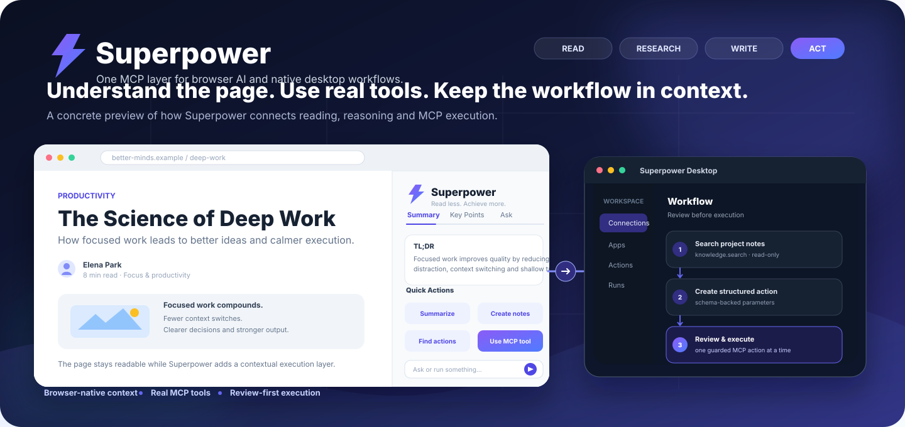
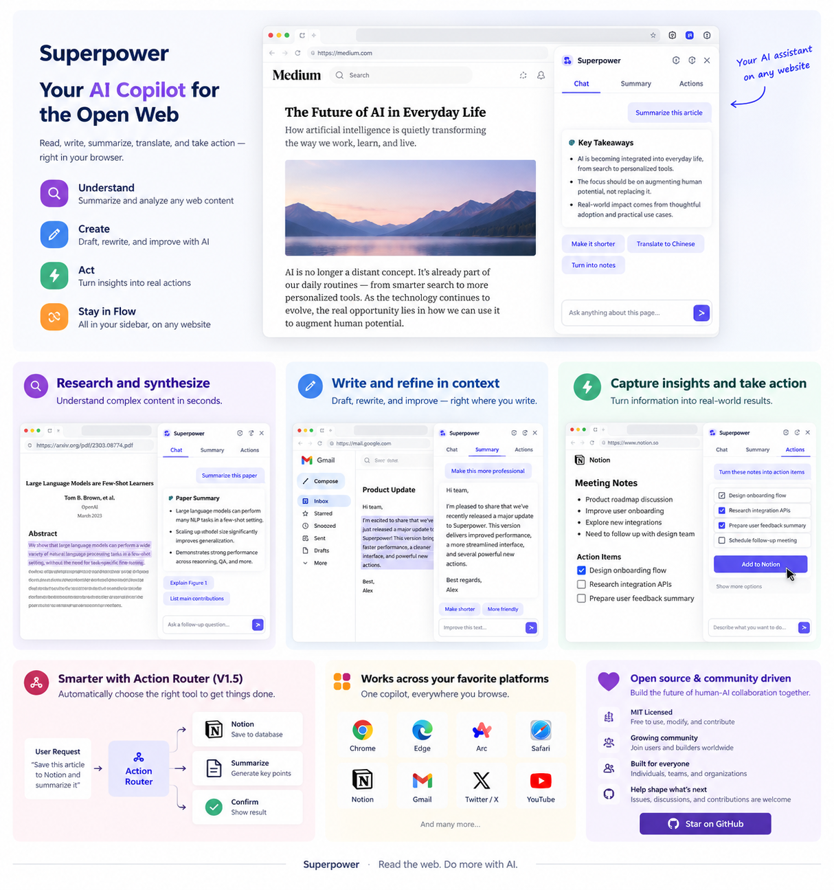
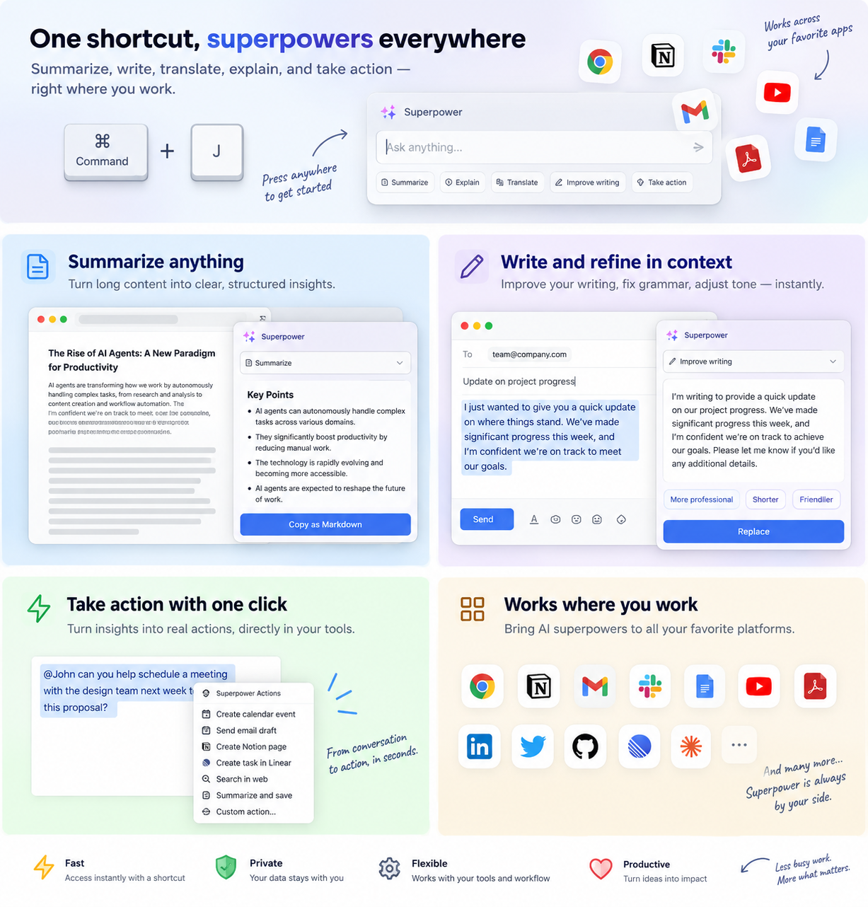
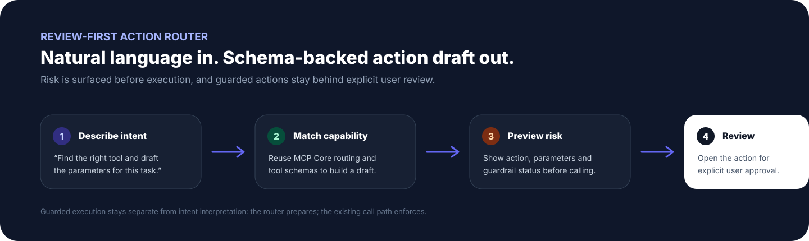
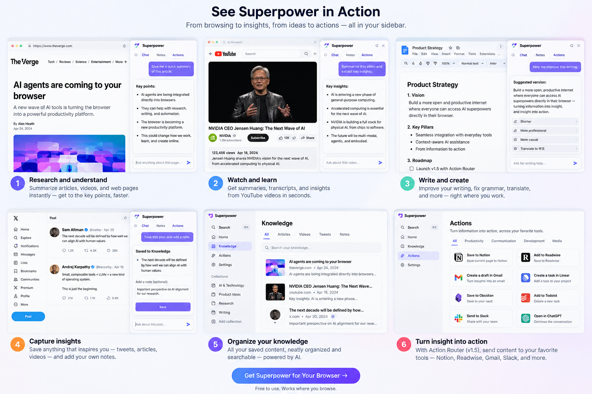
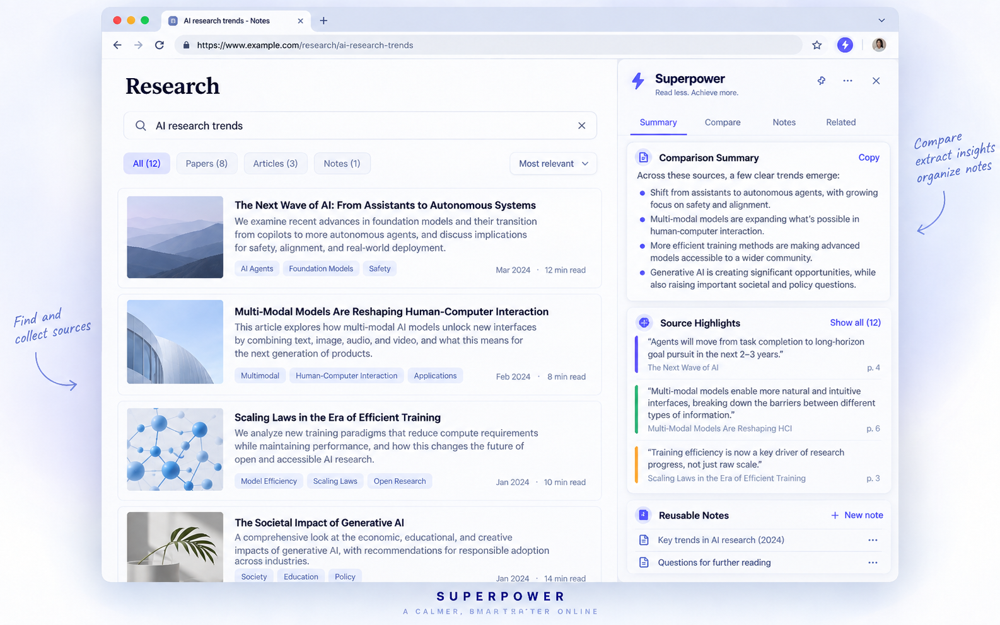
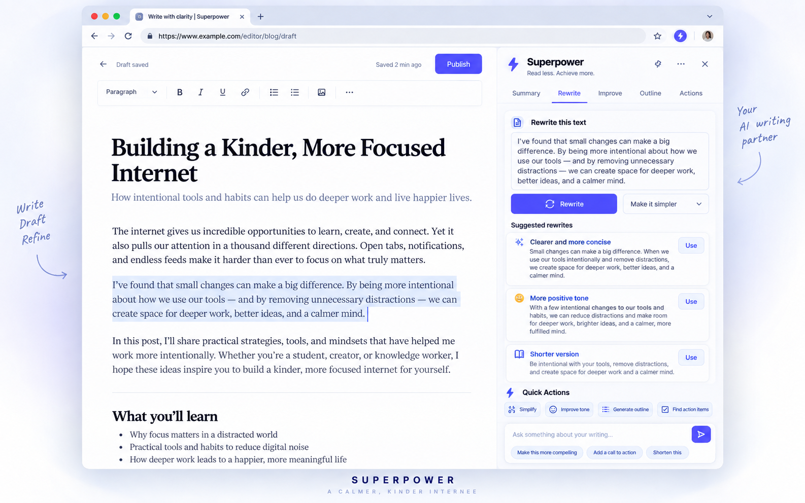
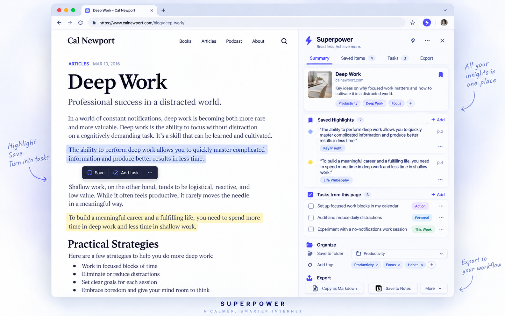
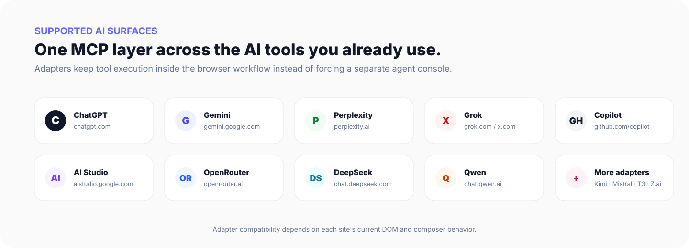

<div align="center">
  

  <h1>Superpower</h1>

  <p><strong>连接浏览器 AI 与原生桌面工作流的统一 MCP 层。</strong></p>

  <p>
    <a href="https://github.com/stloendays/Superpower/stargazers"></a>
    <a href="https://github.com/stloendays/Superpower/releases/tag/v1.4.1"></a>
    
    <a href="https://chromewebstore.google.com/detail/eioecjdcckpdakngpgikbinalieickob?utm_source=item-share-cb"></a>
    
    <a href="LICENSE"></a>
  </p>

  <p>
    <a href="README.md">English</a> · <strong>简体中文</strong>
  </p>

  <p>
    <a href="#superpower-解决什么问题">解决什么问题</a> ·
    <a href="#产品形态">产品</a> ·
    <a href="#产品展示">展示</a> ·
    <a href="#为什么使用-superpower">为什么使用</a> ·
    <a href="#主要功能">功能</a> ·
    <a href="#支持的平台">平台</a> ·
    <a href="#工作原理">架构</a> ·
    <a href="#快速开始">快速开始</a> ·
    <a href="docs/usage/browser-extension.zh-CN.md">操作指南</a> ·
    <a href="#仓库结构">仓库结构</a>
  </p>
</div>

<p align="center">
  
</p>

<div align="center">
  <strong>牛津大学 × 新加坡国立大学合作项目</strong><br/>
  <sub>面向浏览器与桌面环境的实用 MCP 工作流。</sub>
</div>

<br/>

> **版本状态：** v1.4.1 是当前公开稳定版本；V1.5 为主线开发版本，正在加入浏览器 Copilot、任意网页捕获、YouTube 摘要、本地 Knowledge、Connected Actions，以及以审核为核心的工作流执行能力。

## Superpower 解决什么问题？

网页端 AI 很适合负责理解需求、推理和规划，但它通常不能直接使用你的本地文件、命令行工具、私有 MCP Server 或桌面工作流。Superpower 把这两部分连接起来：网页模型负责判断需要做什么，MCP 负责调用真实工具执行，再把结果返回到同一个对话中。

这意味着你可以继续在 **ChatGPT、Gemini、Perplexity、Grok、Copilot、Qwen 等网页端 AI** 中工作，同时使用自己的 MCP 工具。Superpower 不是为了替代 Codex 这类 Coding Agent，而是提供一个 browser-first 的执行层：适合希望保留网页端对话体验、接入自有 MCP、在执行前保留审核步骤，或者希望轻量工具调用不占用另一套本地 Agent 模型额度的场景。

**一句话：让你已经在使用的网页 AI 负责推理，让 MCP 负责执行。**

## 产品形态

<table>
<tr>
<td width="50%" valign="top">

### 浏览器扩展

把 MCP 工具直接带进支持的 AI 网站，不需要离开当前对话。

- 支持 ChatGPT、Gemini、Perplexity、Grok、Qwen 等网页 AI
- 检测结构化工具调用，并把工具结果返回当前对话
- 支持 Streamable HTTP、SSE 与 WebSocket MCP 连接
- 新的本地配置默认推荐使用 **Streamable HTTP**
- 提供工具可见性、自动化与审核控制

**安装：** [Chrome Web Store](https://chromewebstore.google.com/detail/eioecjdcckpdakngpgikbinalieickob?utm_source=item-share-cb)

**适合：** 以网页 AI 对话为主要工作界面的场景。

</td>
<td width="50%" valign="top">

### 桌面应用

**指南：** [桌面端使用与 Quick Ask](docs/usage/desktop-app.zh-CN.md)

在浏览器之外，把 Superpower 作为原生 MCP 工作台使用。

- 原生 **Qt 6** Windows 应用
- 以 **Connections → Apps → Actions → Runs** 组织工作流
- 提供独立 MCP Client、工作流审核与受控执行界面
- 通过 GitHub Releases 提供 Windows 便携包

**适合：** 希望在独立桌面界面统一管理 MCP 连接与动作的场景。

</td>
</tr>
</table>

## 产品展示

<p align="center">
  
  <br /><sub>示意性产品概念图，用于展示 Superpower 如何把研究、写作与工具执行整合到 browser-first 工作流中。当前正式兼容范围请以<a href="#支持的平台">支持的平台</a>一节为准。</sub>
</p>

## 为什么使用 Superpower？

Superpower 尽量让工具执行留在工作发生的界面附近。如果对话本身就是工作区，可以使用浏览器扩展；如果需要独立的 MCP 控制界面，可以使用桌面应用。

<table>
<tr>
<td width="33%" valign="top">

### 保持上下文
直接在当前 AI 对话中使用 MCP 能力，减少在不同工具和控制台之间切换。

</td>
<td width="33%" valign="top">

### 连接真实工具
在浏览器和桌面工作流中连接本地或远程 MCP Server。

</td>
<td width="33%" valign="top">

### 保留控制权
选择暴露哪些工具，并在高风险或状态变更操作执行前进行审核。

</td>
</tr>
</table>

## 主要功能

- 浏览器与桌面端共享 MCP 执行模型
- 面向受支持 AI 网站的浏览器 **Copilot** 工作台，可结合当前选中文本或页面上下文生成任务
- 普通 HTTP(S) 网页上的轻量 **Page Assistant**：支持选中文本 Summarize、Explain、Ask AI、Save，以及整页摘要和行动项提取
- 跨标签 AI 路由：网页任务优先发送到最近使用的受支持 AI 标签页；没有可用 AI 工作区时自动打开 ChatGPT
- YouTube watch 页面增加视频摘要入口：优先使用当前页面可获得的 transcript，无法获得时只基于提供的视频元数据并明确说明
- 一键 **Summarize、Explain、Improve writing、Translate、Action items、Study notes**
- 本地 **Knowledge** 收藏：保存选中文本、页面标题、来源 URL、时间、来源类型与标签，并支持搜索、筛选、复制、删除和 Markdown 导出
- Knowledge 多选工作流：把已保存笔记挂到 Ask、合并多来源总结、导出选中项，或通过 review-first 链路交给兼容的 notes/file MCP 工具
- 在受支持 AI 页面使用 `Ctrl/⌘ + Shift + K` 快速回到 Copilot 工作台
- 浏览器侧工具发现、结构化调用检测与结果回填
- **Connected Actions**：根据已连接的笔记、邮件、日历、任务、Slack/消息、文件存储 MCP 工具动态提供快捷入口，同时继续遵守 review-first 执行链
- 原生桌面 Connections、Apps、Actions、Runs 工作区
- 支持本地与远程 MCP endpoint
- 以审核为核心的自然语言 Action Router
- 带显式跨步骤绑定的 Workflow Planner
- 一次只推进一个受控动作的 session-only Workflow Runner
- 持久化控制项与自动生成的 MCP instructions

<p align="center">
  
  <br /><sub>示意性能力概览：AI 界面负责理解和推理，MCP 作为执行层连接真实工具。</sub>
</p>

### V1.5：Copilot、任意网页捕获、Knowledge 与 Connected Actions

V1.5 开发线现在增加了一个 **Copilot-first 浏览器工作台**。在受支持的 AI 网站中，Superpower 可以读取当前选中文本或有长度边界的页面上下文，为摘要、解释、改写、翻译、行动项提取和学习笔记生成结构化提示，并通过当前网站原有的 AI 输入框提交。选中文本还可以直接保存到本地 **Knowledge**，保留来源信息并导出为 Markdown。

在受支持 AI 网站之外，轻量 **Page Assistant** 会以小型浮层工作，不加载完整 MCP/adapter UI。选中文本或整页任务会被路由到最近使用的受支持 AI 标签页；如果没有可用 AI 工作区，Superpower 会打开 ChatGPT，并等待对应 adapter 就绪后提交。YouTube watch 页面还能从标题、频道、描述和当前页面可获得的 transcript 构建视频摘要请求。

Knowledge 也不再只是本地收藏列表。保存的内容可以按标题、正文、URL 和标签搜索，并按 **Web / YouTube / AI chat / Other** 来源分类筛选；用户可以手工加标签、多选笔记、直接挂到 Copilot 的 Ask 输入中，也可以把多个来源合并总结，同时保留 provenance。选中的 Knowledge 还可以导出为结构化 Markdown，或通过 review-first 工作流交给 Notion、Drive 等兼容的 notes/file MCP 工具。

对于 MCP，Superpower 会把兼容工具提升为 **Connected Actions**。检测到对应工具时，可以直接显示 Save note、Draft email、Plan event、Create task、Draft Slack、Search files 等入口，但这些快捷操作仍然走原有 review-first MCP 链路，不会绕过 schema、缺失参数检查或确认规则。

自然语言 Action Router 继续负责把意图映射到 MCP 能力、按 schema 生成参数、规划多步骤流程并显式记录跨步骤绑定。Workflow Runner 每次最多推进一个 MCP Action，已审核的参数绑定与策略检查保持最高优先级。

<p align="center">
  
</p>

## Superpower 使用场景

<p align="center">
  
  <br /><sub>示意性工作流展示：从阅读和信息整合进入结构化行动，同时尽量保持在同一个工作上下文中。</sub>
</p>

<details>
<summary><strong>查看更多具体使用示例</strong></summary>

<br />

<p align="center">
  
  <br /><sub><strong>研究与信息整合：</strong>收集资料、比较不同来源、提取关键信息，并把可复用笔记保留在当前上下文中。</sub>
</p>

<p align="center">
  
  <br /><sub><strong>写作与改写：</strong>保留原始草稿上下文，同时通过 MCP 动作完成改写、简化、语气调整和大纲整理。</sub>
</p>

<p align="center">
  
  <br /><sub><strong>收藏并执行：</strong>保存有价值的高亮内容，将信息转成任务，完成分类整理后继续导出到后续工作流。</sub>
</p>

</details>

## 支持的平台

浏览器扩展目前支持 ChatGPT、Google Gemini、Perplexity、Google AI Studio、Grok、OpenRouter、DeepSeek、T3 Chat、GitHub Copilot、Mistral、Kimi、Qwen Chat 与 Z.ai。

<p align="center">
  
</p>

## 工作原理

<p align="center">
  
</p>

1. 浏览器或桌面工作流选择一个 MCP 能力。
2. Superpower 通过已配置的 MCP 连接路由结构化请求。
3. MCP Server 执行工具。
4. 结果返回当前浏览器对话或桌面工作流。

## 快速开始

### 浏览器扩展

1. 从 [Chrome Web Store 安装 Superpower](https://chromewebstore.google.com/detail/eioecjdcckpdakngpgikbinalieickob?utm_source=item-share-cb)。
2. 在 Chrome 中打开扩展并配置 MCP 连接。
3. 标准本地 Proxy 推荐使用 **Streamable HTTP**，地址为 `http://localhost:3006/mcp`。
4. 打开受支持的 AI 网站。V1.5 开发线会默认进入 **Copilot**；也可以按 `Ctrl/⌘ + Shift + K` 快速回到 Copilot。
5. 在普通网页上，可以使用右下角的轻量 **Page Assistant** 摘要选中文本/整页、保存到 **Knowledge**，或把任务送到当前 AI 工作区；YouTube watch 页面会额外提供 **Summarize video**。
6. 在 Copilot 中，检测到兼容 MCP 工具时可以直接使用 **Connected Actions**；需要完整工具参数界面时切换到 **Tools**。

> **连接兼容性：** 新的本地配置默认使用 Streamable HTTP。显式的旧版 SSE endpoint（例如 `http://localhost:3006/sse`）和 WebSocket endpoint 仍然支持；已有用户保存的连接配置不会被强制覆盖。

**第一次使用？** 按 [浏览器扩展操作指南](docs/usage/browser-extension.zh-CN.md) 完成“连接 MCP → 检查工具 → 检查 Instructions → 先做只读测试”的完整流程。同一份指南也说明如何**不上传 Chrome Web Store，直接测试本地开发版本**。

手动安装或开发环境安装请参阅 [`docs/install/windows-extension.md`](docs/install/windows-extension.md)。

### 桌面应用

1. 打开 [最新 Release](https://github.com/stloendays/Superpower/releases/latest)。
2. 下载 `Superpower-Desktop-*-Windows-x64.zip`。
3. 解压并启动打包后的桌面应用。

### 从源码构建浏览器扩展

要求：**Node.js 22.12+**、**pnpm 9.x**，以及 Chromium 系浏览器。

```bash
git clone https://github.com/stloendays/Superpower.git
cd Superpower
pnpm install
pnpm base-build
```

配置 MCP Proxy，使用需要的 transport 启动，然后在浏览器中把 `dist/` 作为“已解压扩展”加载。具体的重新构建、重新加载扩展与刷新 AI 网页流程，请看 [不上传商店，直接测试本地版本](docs/usage/browser-extension.zh-CN.md#不上传商店直接测试本地版本)。

## 开发

```bash
pnpm dev          # 开发构建
pnpm base-build   # 生产构建
pnpm type-check   # 类型检查
pnpm lint         # Lint
```

## 仓库结构

仓库根目录保留项目入口所需的标准文档、workspace/build 配置和主要产品目录；实现辅助文件与可选示例放在独立目录中。

```text
Superpower/
├── chrome-extension/          # 浏览器扩展 shell 与 background 集成
├── desktop/                   # 原生 Qt 桌面应用与桌面示例
├── docs/                      # 文档、安装指南和 README/site 资源
├── packages/                  # 可复用 TypeScript package，包括 MCP Core/Host
├── pages/                     # 浏览器扩展页面与 content scripts
├── scripts/
│   ├── install/               # Windows 源码/Release 安装辅助脚本
│   └── shell/                 # 构建、环境与版本脚本
├── README.md                  # 英文项目主页
├── README.zh-CN.md            # 简体中文项目主页
├── CHANGELOG.md
├── SECURITY.md
└── LICENSE
```

## 安全

Superpower 会执行用户配置的 MCP 工具。只有在你信任 MCP Server 来源与配置的范围内，才应信任相应工具和输出。

- 连接前检查 MCP Server 配置。
- 不要把凭据放进公开配置文件或 Issue。
- 不需要远程访问时，优先使用仅 loopback 可访问的本地 endpoint。
- 状态变更或高风险动作执行前应进行审核。

当前安全说明请参阅 [`SECURITY.md`](SECURITY.md)。

## 贡献

欢迎提交 Issue 与 Pull Request。建议让改动保持聚焦，记录行为变化，并在可行时附带验证结果。

## 项目关键词

Superpower 面向使用 **Model Context Protocol (MCP)**、**AI Agent**、**浏览器自动化**、**Chrome 扩展**、**Agentic Workflow**、**Tool-using LLM**、**本地 MCP Server**、**桌面 AI 工作流**、**Qt 6** 与 **Human-in-the-loop execution** 的开发者和研究者。

常用检索词：`MCP browser extension`、`Model Context Protocol Chrome extension`、`ChatGPT MCP tools`、`Gemini MCP`、`browser AI agent`、`agentic workflow`、`tool calling`、`MCP desktop client`、`MCP Streamable HTTP`、`human in the loop MCP`。

## License

Superpower 使用 [MIT License](LICENSE) 发布。
